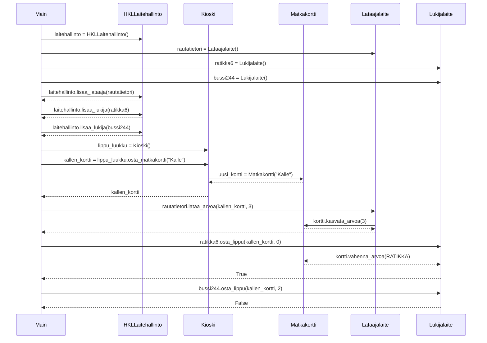

```mermaid
sequenceDiagram
participant Main
participant HKLLaitehallinto
participant Kioski
participant Matkakortti
participant Lataajalaite
participant Lukijalaite


Main->>HKLLaitehallinto: laitehallinto = HKLLaitehallinto()
Main->>Lataajalaite: rautatietori = Lataajalaite()
Main->>Lukijalaite: ratikka6 = Lukijalaite()
Main->>Lukijalaite: bussi244 = Lukijalaite()

Main->>HKLLaitehallinto: laitehallinto.lisaa_lataaja(rautatietori)
HKLLaitehallinto-->>Main: 
Main->>HKLLaitehallinto: laitehallinto.lisaa_lukija(ratikka6)
HKLLaitehallinto-->>Main: 
Main->>HKLLaitehallinto: laitehallinto.lisaa_lukija(bussi244)
HKLLaitehallinto-->>Main: 

Main->>Kioski: lippu_luukku = Kioski()
Main->>Kioski: kallen_kortti = lippu_luukku.osta_matkakortti("Kalle")
Kioski->>Matkakortti: uusi_kortti = Matkakortti("Kalle")
Matkakortti-->>Kioski: 
Kioski-->>Main: kallen_kortti

Main->>Lataajalaite: rautatietori.lataa_arvoa(kallen_kortti, 3)
Lataajalaite->>Matkakortti: kortti.kasvata_arvoa(3)
Matkakortti-->>Lataajalaite: 
Lataajalaite-->>Main: 

Main->>Lukijalaite: ratikka6.osta_lippu(kallen_kortti, 0)
Lukijalaite->>Matkakortti: kortti.vahenna_arvoa(RATIKKA)
Matkakortti-->>Lukijalaite: 
Lukijalaite-->>Main: True

Main->>Lukijalaite: bussi244.osta_lippu(kallen_kortti, 2)
Lukijalaite-->>Main: False
```