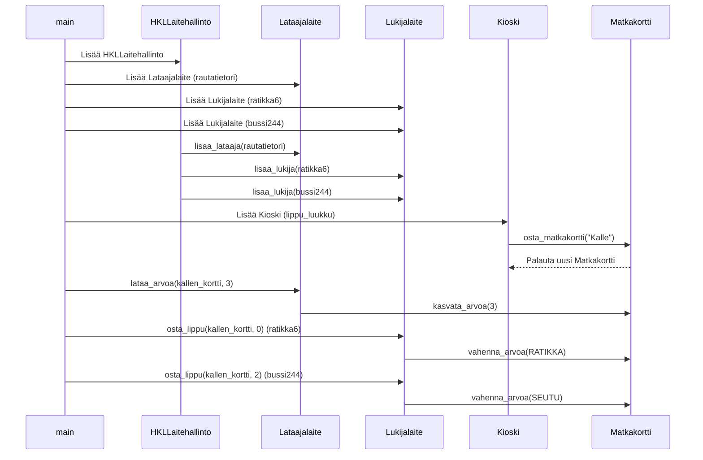

```mermaid
    sequenceDiagram
        #Muuttujat
        participant main
        participant HKLLaitehallinto
        participant Lataajalaite
        participant Lukijalaite
        participant Kioski
        participant Matkakortti

        main->>HKLLaitehallinto: Lisää HKLLaitehallinto
        main->>Lataajalaite: Lisää Lataajalaite (rautatietori)
        main->>Lukijalaite: Lisää Lukijalaite (ratikka6)
        main->>Lukijalaite: Lisää Lukijalaite (bussi244)
        HKLLaitehallinto->>Lataajalaite: lisaa_lataaja(rautatietori)
        HKLLaitehallinto->>Lukijalaite: lisaa_lukija(ratikka6)
        HKLLaitehallinto->>Lukijalaite: lisaa_lukija(bussi244)
        main->>Kioski: Lisää Kioski (lippu_luukku)
        Kioski->>Matkakortti: osta_matkakortti("Kalle")
        Matkakortti-->>Kioski: Palauta uusi Matkakortti
        main->>Lataajalaite: lataa_arvoa(kallen_kortti, 3)
        Lataajalaite->>Matkakortti: kasvata_arvoa(3)
        main->>Lukijalaite: osta_lippu(kallen_kortti, 0) (ratikka6)
        Lukijalaite->>Matkakortti: vahenna_arvoa(RATIKKA)
        main->>Lukijalaite: osta_lippu(kallen_kortti, 2) (bussi244)
        Lukijalaite->>Matkakortti: vahenna_arvoa(SEUTU)

```
