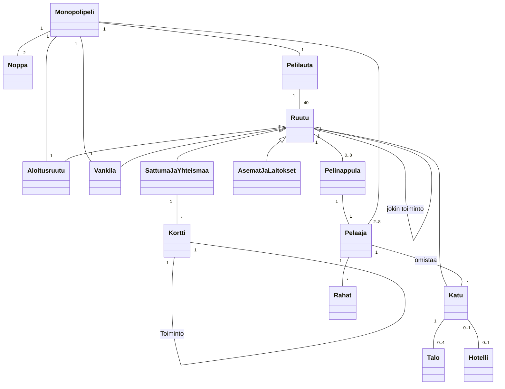

## Monopoli, alustava luokkakaavio

```mermaid
classDiagram
Monopolipeli "1" -- "2" Noppa
Monopolipeli "1" -- "1" Pelilauta
Monopolipeli "1" -- "1" Aloitusruutu
Monopolipeli "1" -- "1" Vankila
Pelilauta "1" -- "40" Ruutu
Ruutu <|-- Aloitusruutu
Ruutu <|-- Vankila
Ruutu <|-- SattumaJaYhteismaa
Ruutu <|-- AsematJaLaitokset
Ruutu <|-- Katu
Ruutu "1" -- "1" Ruutu : jokin toiminto
Ruutu "1" -- "0..8" Pelinappula
SattumaJaYhteismaa "1" -- "*" Kortti
Kortti "1" -- "1" Kortti: Toiminto
Katu "1" -- "0..4" Talo
Katu "0..1" -- "0..1" Hotelli
Pelinappula "1" -- "1" Pelaaja
Pelaaja "2..8" -- "1" Monopolipeli
Pelaaja "1" -- "*" Katu : omistaa
Pelaaja "1" -- "*" Rahat
```