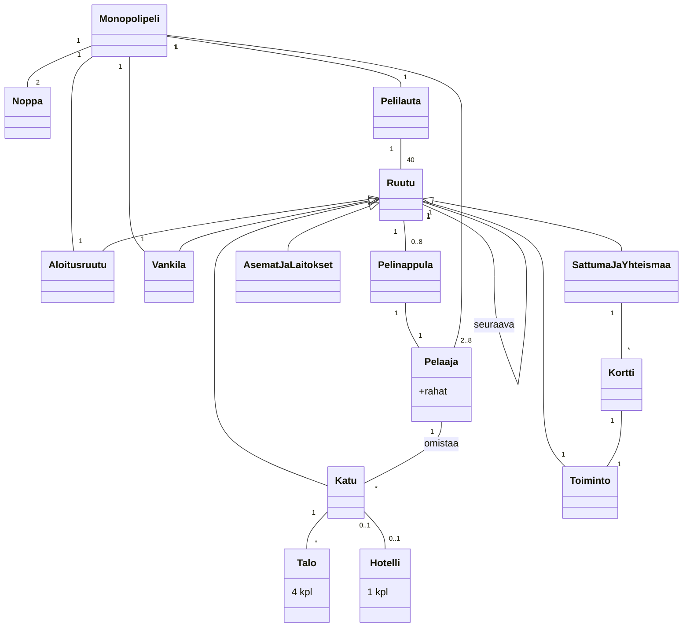

## Monopoli, alustava luokkakaavio

```mermaid
    classDiagram
    Monopolipeli "1" -- "2" Noppa
    Monopolipeli "1" -- "1" Pelilauta
    Monopolipeli "1" -- "1" Aloitusruutu
    Monopolipeli "1" -- "1" Vankila
    Pelilauta "1" -- "40" Ruutu
    Ruutu <|-- Aloitusruutu
    Ruutu <|-- Vankila
    Ruutu <|-- SattumaJaYhteismaa
    Ruutu <|-- AsematJaLaitokset
    Ruutu <|-- Katu
    Ruutu "1" -- "1" Ruutu : seuraava
    Ruutu "1" -- "0..8" Pelinappula
    Ruutu "1" -- "1" Toiminto
    SattumaJaYhteismaa "1" -- "*" Kortti
    Kortti "1" -- "1" Toiminto
    Katu "1" -- "*" Talo
    Katu "0..1" -- "0..1" Hotelli
    Pelinappula "1" -- "1" Pelaaja
    Pelaaja "2..8" -- "1" Monopolipeli
    Pelaaja "1" -- "*" Katu : omistaa
    Pelaaja : +rahat
    Talo : 4 kpl
    Hotelli : 1 kpl
```

